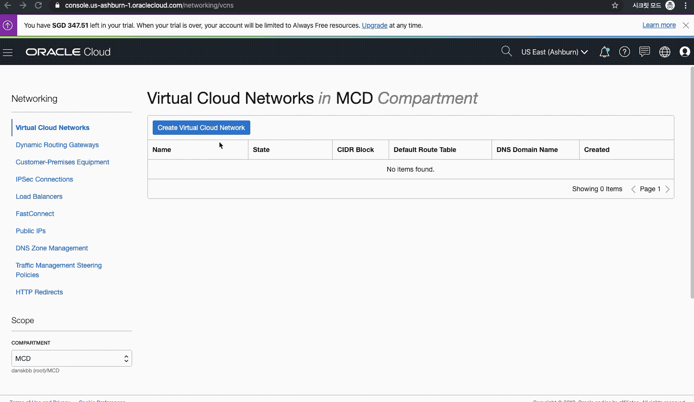

# Oracle Functions with GraalVM on OCI Hands-On (Oracle Modern Cloud Day 2019의 Tech Hands-on Track)

Oracle Modern Cloud Day 2019의 Developer Hands-on Track


## Introduction
본 핸즈온 문서는 Oracle Serverless 서비스인 Oracle Function Cloud Service 사용 방법과 간단한 Java Function, GraalVM을 사용한 Native Java Function을 배포하는 과정을 다루고 있습니다. 본 과정을 통해서 기본적인 Oracle Function Cloud Service 사용법과 Native Java Function에 대한 이해 및 배포, 실행에 대한 경험을 해볼 수 있습니다.

## Objectives
* Serverless 이해
* GraalVM의 Native Image 이해
* Oracle Function Cloud Service 이해 및 사용 방법

## Required Artifacts
* 인터넷 접속 가능한 랩탑
* OCI (Oracle Cloud Infrastructure) 계정
* SSH Terminal (windows Putty, macOS Terminal 등)

## 실습을 위한 클라이언트 환경
다음 주소를 클릭합니다. 본인의 이메일 주소를 입력하면 실습을 위한 클라이언트 환경을 할당받을 수 있습니다.
--- 여기서 이메일 입력, 제출 클릭하면 Private/Public Key (Putty, OpenSSH), IP, 접속 계정을 전달 받는다.

```
ssh -i id_rsa opc@140.238.18.26
```

## Oracle Functions Cloud Service 및 GraalVM Native Image 소개 (장표 설명, 10분 ~ 15분)
Presentation은 Gitpitch를 사용할 예정임.
[](https://gitpitch.com/mangdan/oracle-resource-manager-handson#/)

Oracle Functions (with Fn Project)와 고성능, Polygrot VM인 GraalVM을 사용한 Native Java Image에 대한 간략한 소개 및 이점등에 대한 내용을 설명

## Hands-On Steps (30분)
전체 과정
**STEP 1**: GraalVM CE 설치  
**STEP 2**: OCIR (Oracle Container Infrastructure Registry) Login 정보 확인  
**STEP 3**: Docker Login  
**STEP 4**: Fn Project CLI 설정  
**STEP 5**: VCN 생성  
**STEP 6**: Function Application 생성  
**STEP 7**: Java Function 생성  
**STEP 8**: Java Function 배포 및 업데이트  
**STEP 9**: Functin 호출 테스트  
**STEP 10**: GraalVM을 사용한 Native Java Function 생성  
**STEP 11**: Native Java Function 배포 및 업데이트  
**STEP 12**: Native Java Functin 호출 테스트  

## Hands-On
***

### **STEP 1**: OCIR (Oracle Container Infrastructure Registry) Login을 위한 기본 정보
Oracle Function을 사용하기 위해서는 기본적으로 Docker를 활용하여 이미지를 생성하고, 이를 Docker Registry에 푸시 합니다. Docker Registry는 Oracle Cloud Infrastructure (이하 OCI)에서 제공하는 Oracle Container Infrastructure Registry (이하 OCIR)를 사용하게 됩니다. OCIR 접속을 위한 정보는 Registry URL, Username, Password로 각각의 정보를 얻는 과정은 다음과 같습니다.

1. Registry URL
- 기본 주소 포멧
    > **{region_code}.ocir.io**  
    > regison_code는 https://docs.cloud.oracle.com/iaas/Content/General/Concepts/regions.htm 에서 확인가능

- 본 실습에서는 애시번 (iad)리전의 Registry를 사용
    > iad.ocir.io  
    > 
    > <font color='red'>(Registry URL은 Function 설정시에도 필요하므로 메모합니다!)</font>

2. Username
- 기본 OCIR 사용자 아이디 포멧
    > **{tenancy_namespace}/{oci계정}**
- tenancy_namespace 확인
    > OCI Console 로그인 (https://console.us-ashburn-1.oraclecloud.com) 후 우측 상단의 사용자 아이콘 클릭 > 해당 Tenancy 이름 클릭 >  **Object Storage Namespace** 값 확인

    

- oci계정 확인
    > OCI Console 로그인 후 우측 상단의 사용자 아이콘 클릭 > Profile 바로 밑의 사용자 아이디를 클릭 > ID 확인

    

- OCIR Username 예시: idsufmye3lml/oracleidentitycloudservice/donghu.kim@oracle.com  
<font color='red'>(Tenancy Namespace는 Function 설정시에도 필요하므로 메모합니다!)</font>

3. Password
- OCIR 로그인을 위한 임시 토큰 발행
    > OCI Console 로그인 후 우측 상단의 사용자 아이콘 클릭 > Profile 바로 밑의 사용자 아이디를 클릭 > 좌측 Auth Tokens 클릭 > Generate Token 클릭 > Description에 **ocir-token** 입력 후 Generate Token 클릭 > 생성된 토큰을 복사   
    <font color='red'>(토큰은 Function 설정시에도 필요하므로 메모합니다!)</font>

    

### **STEP 2**: Docker Login
docker login 명령어를 사용하여 OCIR에 로그인하는 과정입니다.
```
$ docker login {Registry URL} --username {Username} --password '{Password}'
```
다음은 접속 예시입니다.
```shell
$ docker login icn.ocir.io --username idsufmye3lml/oracleidentitycloudservice/donghu.kim@oracle.com --password 'hT{+t3KnuF.5x42a(>l)'

WARNING! Using --password via the CLI is insecure. Use --password-stdin.
WARNING! Your password will be stored unencrypted in /home/admin/.docker/config.json.
Configure a credential helper to remove this warning. See
https://docs.docker.com/engine/reference/commandline/login/#credentials-store

Login Succeeded
```

### **STEP 3**: Fn Project CLI 설정
실습에서는 미리 설치되어 있는 Fn Project CLI를 사용합니다. Fn Project CLI 설치 후 Fn Project CLI에서 필요로 하는 정보를 Context로 생성해서 구성해야 합니다.
> Fn Project CLI 설치에 대한 가이드는 아래 페이지를 참고하세요.  
> Fn Project CLI Install Guide (https://fnproject.io/tutorials/install/)

1. Fn Project CLI 설치 확인합니다.
    ```shell
    $ fn version
    ```

2. Function의 Context를 생성합니다.
    기본 사용법은 다음과 같습니다.
    ```shell
    $ fn create context <my-context> --provider oracle
    ```

    <my-context>는 관리할 Context의 이름으로 실습에서는 **helloworld**로 지정하여 다음과 같이 생성합니다.
    ```shell
    $ fn create context helloworld --provider oracle

    Successfully created context: helloworld
    ```

3. Fn Project CLI에서 위에서 생성한 Context를 사용하도록 설정합니다.
    ```shell
    $ fn use context helloworld
    ```

4. 생성한 Context를 업데이트 합니다. 필요한 정보는 OCI CLI의 Profile, function 서버의 API URL, Compartment OCID, Container Registry로 먼저 OCI CLI의 Profile을 업데이트합니다.
    
    Fn Project Context에 OCI Profile 업데이트는 다음과 같이 실행합니다.
    ```shell
    $ fn update context oracle.profile <profile-name>
    ```

    oci-cli의 profile은 다음과 같이 확인할 수 있습니다. **[DEFAULT]** 부분이 profile명입니다.
    ```shell
    $ cat ~/.oci/config

    [DEFAULT]
    user=ocid1.user.oc1..aaaaaaaalpieyqquaaneneuyiifrtfbzwcr3hqd7tqfoobwq7xr4jv5pfz3a
    fingerprint=48:1a:98:8c:cd:f6:63:4b:fb:4d:8d:26:44:aa:37:f6
    key_file=/Users/DonghuKim/.oci/oci_api_key.pem
    tenancy=ocid1.tenancy.oc1..aaaaaaaa6ma7kq3bsif76uzqidv22cajs3fpesgpqmmsgxihlbcemkklrsqa
    region=ap-seoul-1
    ```

    실제 profile[DEFAULT]을 적용하여 업데이트합니다.
    ```
    $ fn update context oracle.profile DEFAULT
    ```

<details>
<summary>
<i>참고) oci-cli와 config 파일</i>
</summary>

oci-cli는 Oracle Cloud Infrastructure를 관리하기 위한 CLI (Command Line Interface) 도구입니다. oci-cli를 사용하면 REMOTE에서 oci-cli 명령어를 사용하여 인프라를 제어할 수 있습니다. 본 실습에서는 시간 관계상 미리 구성한 oci-cli를 사용합니다. oci-cli 설치를 한 후 OCI와 연결하기 위한 Config 설정을 하며, 그 결과물이 ~/.oci/config 파일에 만들어지게 됩니다. 해당 파일에는 사용자, Region, Tenancy에 따라서 Profile로 관리되는데 기본 Profile명은 DEFAULT 입니다. Function에서는 oci-cli를 내부적으로 사용하는데, 이 때 oci-cli의 config내에 접속할 Profile명이 필요합니다.

oci-cli 설치 및 구성은 다음 페이지를 참고합니다.
> https://docs.cloud.oracle.com/iaas/Content/API/SDKDocs/cliinstall.htm

</details>

5. OCI에서 제공하는 Function API URL을 업데이트 합니다.
    ```shell
    $ fn update context api-url https://functions.us-ashburn-1.oraclecloud.com
    ```

<details>
<summary>
<i>참고) Region별 Function API URL</i>
</summary>

Function API Url은 각 Region별로 URL을 제공합니다. 배포하고자 하는 리전에 맞춰서 Function API URL을 사용합니다.

> 뭄바이: https://functions.ap-mumbai-1.oci.oraclecloud.com  
> 서울: https://functions.ap-seoul-1.oci.oraclecloud.com  
> 시드니: https://functions.ap-sydney-1.oci.oraclecloud.com  
> 도쿄: https://functions.ap-tokyo-1.oci.oraclecloud.com  
> 토론토: https://functions.ca-toronto-1.oci.oraclecloud.com  
> 프랑크프루트: https://functions.eu-frankfurt-1.oci.oraclecloud.com  
> 취리히: https://functions.eu-zurich-1.oci.oraclecloud.com  
> 상파울로: https://functions.sa-saopaulo-1.oci.oraclecloud.com  
> 런던: https://functions.uk-london-1.oci.oraclecloud.com  
> 애시번: https://functions.us-ashburn-1.oci.oraclecloud.com  
> 피닉스: https://functions.us-phoenix-1.oci.oraclecloud.com  

</details>


6. Compartment OCID를 업데이트 합니다. OCI Console에서 MCD Compartment의 OCID를 확인합니다.
    > 메뉴 > Identity > Compartments > MCD 선택

    

    기본 사용법은 다음과 같습니다.
    ```shell
    $ fn update context oracle.compartment-id <compartment-ocid>
    ```

    실제 Compartment OCID를 적용한 예시입니다.
    ```shell
    $ fn update context oracle.compartment-id ocid1.compartment.oc1..aaaaaaaanojzru4tvrayjwezor2dlbo2um25xodb5bz2zp4kyx3nj7xgax6a
    ```

7. Oracle Container Registry URL과 Repository 설정입니다.
    기본 사용법은 다음과 같습니다.
    ```shell
    $ fn update context registry <region-code>.ocir.io/<tenancy-namespace>/<repo-name>
    ```

    실제 region-code, tenancy-namespace, repo-name을 적용한 예시입니다. repo-name은 helloworld로 통일합니다.
    ```shell
    $ fn update context registry iad.ocir.io/idsufmye3lml/helloworld
    ```

8. 설정된 context의 내용을 확인합니다.
    ```shell
    $ cat $HOME/.fn/contexts/helloworld.yaml

    api-url: https://functions.us-ashburn-1.oraclecloud.com
    oracle.compartment-id: ocid1.compartment.oc1..aaaaaaaanojzru4tvrayjwezor2dlbo2um25xodb5bz2zp4kyx3nj7xgax6a
    oracle.profile: DEFAULT
    provider: oracle
    registry: iad.ocir.io/idsufmye3lml/helloworld
    ```

### **STEP 4**: VCN 생성
Function Application에서 사용할 Network 설정을 하는 과정입니다.

1. VCN 메뉴
    > 메뉴 > Network > Virtual Cloud Networks를 클릭

    

2. Virtual Cloud Network 생성
    > MCD Compartment를 선택 > Create Virtual Cloud Network 클릭
    - Name: fn_vcn
    - CREATE VIRTUAL CLOUD NETWORK PLUS RELATED RESOURCES: Check
    

3. VCN 생성 확인


### **STEP 5**: Function Application 생성
Function Application은 Function의 논리적인 그룹으로 Function Application에는 다수의 Function이 포함될 수 있으며, VCN과 Configuration을 공유합니다.

1. Function Application 생성 메뉴
    > 메뉴 > Developer Services > Functions 선택

    

2. Function Application 생성
    > Create Application을 클릭 >  아래와 같이 입력 > **Create** 버튼 클릭
    - NAME: helloworld-app
    - VCN in {Compartment}: fn_vcn
    - SUBNETS in {Compartment}: 생성된 Subnet 선택

    

### **STEP 6**: Java Function 생성

<details>
<summary>
<i>참고) 다양한 언어를 지원하는 Oracle Functions</i>
</summary>

Oracle Functions는 현재 Java, Go, Node.js, Ruby, Python 언어를 공식적으로 지원하고 있습니다. 다음은 각 언어별로 초기 Function을 생성하는 명령어입니다.

Java
> ```shell
> $ fn init --runtime java javafn
> ```
Go
> ```shell
> $ fn init --runtime go gofn
> ```
Node.js
> ```shell
> $ fn init --runtime node nodefn
> ```
Ruby
> ```shell
> $ fn init --runtime ruby rubyfn
> ```
Python
> ```shell
> $ fn init --runtime python pythonfn
> ```

</details>

1. 여기서는 Standard VM을 사용하는 Java Function을 생성합니다. 동일한 클라이언트 환경에서 실습을 진행하는 관계로 서로 다른 이미지 이름을 갖도록 Function 이름 마지막에 구분할 수 있는 유니크한 값(e.g. abcde1)을 추가합니다.
```
$ fn init --runtime java helloworld-func-{unique-value}
```

2. 생성된 Function은 다음과 같은 구조를 가지고 있습니다.
```
.
├── helloworld-func-abcde1
│   ├── func.yaml
│   ├── pom.xml
│   └── src
│       └── main/java/com/example/fn
│           └── HelloFunction.java
│       └── test/java/com/example/fn
│           └── HelloFunctionTest.java
└──
```

func.yaml
```yaml
schema_version: 20180708
name: helloworld-func-abcde1
version: 0.0.9
runtime: java
build_image: fnproject/fn-java-fdk-build:jdk11-1.0.104
run_image: fnproject/fn-java-fdk:jre11-1.0.104
cmd: com.example.fn.HelloFunction::handleRequest
```

HelloFunction.java
```java
package com.example.fn;

public class HelloFunction {

    public static class Input {
        public String name;
    }

    public static class Result {
        public String salutation;
    }

    public Result handleRequest(Input input) {
        Result result = new Result();
        result.salutation = "Hello " + input.name;
        return result;
    }

}
```

### **STEP 7**: Java Function 배포 및 업데이트
생성한 Function을 배포해보겠습니다. 다음과 같이 실행합니다. 
> 배포 시 다음과 같은 오류가 발생할 경우는 Docker login이 되어 있지 않은 경우입니다. 이 경우 다시 docker login을 한 후 재시도합니다.  
> 
> denied: Anonymous users are only allowed read access on public repos
> Fn: error running docker push, are you logged into docker?: exit status 1

Function 배포
```shell
$ cd helloworld-func-abcde1

$ fn deploy --app helloworld-app
```

Function 업데이트 (memory: 256M(default: 128M), timeout: 60s(default: 30s))
```shell
$ fn update function helloworld-app helloworld-func-abcde1 --memory 256 --timeout 60
```

### **STEP 8**: Function 호출 테스트
time을 사용하여 Function 호출 후 실행 완료하기까지 소요되는 시간을 체크합니다. 일반 Java VM을 사용한 경우 Cold Start 타임이 대략 6초 소요된 것을 확인할 수 있습니다.

```shell
$ time fn invoke helloworld-app helloworld-func-abcde1

Hello, world!

real    0m6.357s
user    0m0.084s
sys m0.012s
```

### **STEP 9**: GraalVM을 사용한 Native Java Function 생성
이번에는 GraalVM을 사용하여 Java Function을 Native Image로 생성해보도록 하겠습니다.

1. GraalVM 설치 확인을 합니다. (실습 시간 관계상 미리 설치된 GraalVM을 사용합니다.)

```shell
$ java -version
openjdk version "1.8.0_232"
OpenJDK Runtime Environment (build 1.8.0_232-20191008104205.buildslave.jdk8u-src-tar--b07)
OpenJDK 64-Bit GraalVM CE 19.2.1 (build 25.232-b07-jvmci-19.2-b03, mixed mode)
```

<details>
<summary>
<i>참고) GraalVM 설치</i>
</summary>

GraalVM CE를 설치하는 방법은 여러가지가 있습니다. GraalVM은 [GraalVM 다운로드 페이지](https://www.graalvm.org/downloads/)에서 패키징된 파일을 다운로드 받을 수 있습니다. GraalVM EE의 경우는 [Oracle에서 제공하는 페이지](https://www.oracle.com/downloads/graalvm-downloads.html)에서 다운로드 받을 수 있습니다.
macOS의 경우는 brew를 사용해서 설치할 수도 있습니다.

macOS Homebrew를 통한 설치
```
$ brew cask install graalvm/tap/graalvm-ce
```

직접 다운로드 받아서 설치도 가능하지만, SDKMAN이라고 하는 SDK 관리툴을 사용하여 GraalVM을 설치 및 관리할 수 있습니다.

1. SDKMAN 설치
```shell
$ curl -s "https://get.sdkman.io" | bash
$ source "$HOME/.sdkman/bin/sdkman-init.sh"
```

2. SDKMAN 에서 지원하는 Java 목록 확인
```shell
$ sdk list java
```

3. GraalVM 설치
```shell
$ sdk install java 19.2.1-grl
```

4. GraalVM 설치 확인
```shell
$ java -version
openjdk version "1.8.0_232"
OpenJDK Runtime Environment (build 1.8.0_232-20191008104205.buildslave.jdk8u-src-tar--b07)
OpenJDK 64-Bit GraalVM CE 19.2.1 (build 25.232-b07-jvmci-19.2-b03, mixed mode)
```

</details>

2. 마찬가지로 동일한 클라이언트 환경에서 실습을 진행하는 관계로 서로 다른 이미지 이름을 갖도록 Function 이름 마지막에 구분할 수 있는 유니크한 값(e.g. abcde1)을 추가한 후 생성합니다. 
> Native Function으로 생성할 경우 Fuction이름에 "-"와 같은 특수문자를 사용할 수 없습니다.
```shell
$ fn init --init-image fnproject/fn-java-native-init graalfunc{unique-value}
```

2. 생성된 Function은 다음과 같은 구조를 가지고 있습니다. Native-Image 생성을 위해 Dockerfile이 추가된 것을 확인할 수 있습니다.

내용은 일반 Standard Java VM을 사용하는 경우와 동일하나, Native Image 생성을 위한 Dockerfile이 포함되어 있습니다.

```
.
├── graalfuncdhkim1
│   ├── Dockerfile
│   ├── func.yaml
│   ├── pom.xml
│   └── src
│       └── main/java/com/example/fn
│           └── Graalfuncabcde1.java
│       └── test/java/com/example/fn
│           └── Graalfuncabcde1Test.java
└──
```

### **STEP 10**: Native Java Function 배포 및 업데이트
생성한 Function을 배포해보겠습니다. 다음과 같이 실행합니다. 
> 배포 시 다음과 같은 오류가 발생할 경우는 Docker login이 되어 있지 않은 경우입니다. 이 경우 다시 docker login을 한 후 재시도합니다.  
> 
> denied: Anonymous users are only allowed read access on public repos
> Fn: error running docker push, are you logged into docker?: exit status 1

Function 배포
```shell
$ cd graalfuncabcde1

$ fn deploy --app helloworld-app
```

Function 업데이트 (memory: 256M(default: 128M), timeout: 60s(default: 30s))
```shell
$ fn update function helloworld-app graalfuncabcde1 --memory 256 --timeout 60
```

### **STEP 11**: Native Java Functin 호출 테스트
time을 사용하여 Function 호출 후 실행 완료하기까지 소요되는 시간을 체크합니다. GraalVM의 Native Image를 사용한 경우 Cold Start 타임이 대략 3초 소요된 것을 확인할 수 있습니다.

```shell
$ time fn invoke helloworld-app graalfuncabcde1

Hello, world!

real	0m3.024s
user	0m0.081s
sys 0m0.012s
```


## 참고
https://medium.com/criciumadev/serverless-native-java-functions-using-graalvm-and-fn-project-c9b10a4a4859
https://medium.com/thundra/mastering-java-cold-start-on-aws-lambda-volume-1-21c30ce378b7
https://royvanrijn.com/blog/2018/09/part-2-native-microservice-in-graalvm/ : SubstrateVM
