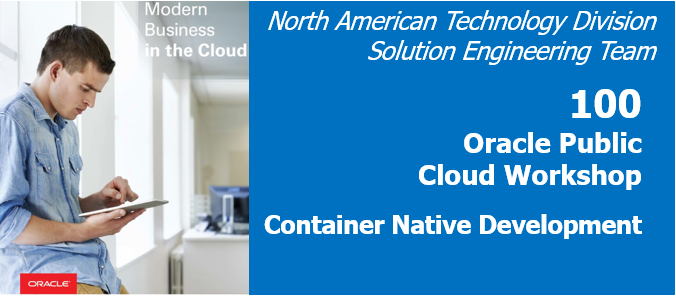

# Oracle Functions with GraalVM on OCI Hands-On (Oracle Modern Cloud Day 2019의 Tech Hands-on Track)


<-- MCD 관련 이미지로 교체 >

## Introduction
본 핸즈온 문서는 Oracle Serverless 서비스인 Oracle Function Cloud Service 사용 방법과 간단한 Java Function, GraalVM을 사용한 Native Java Function을 배포하는 과정을 다루고 있습니다. 본 과정을 통해서 기본적인 Oracle Function Cloud Service 사용법과 Native Java Function에 대한 이해 및 배포, 실행에 대한 경험을 해볼 수 있습니다.

## Objectives
* Serverless 이해
* GraalVM의 Native Image 이해
* Oracle Function Cloud Service 이해 및 사용 방법

## Required Artifacts
* 인터넷 접속 가능한 랩탑
* OCI (Oracle Cloud Infrastructure) 계정
* SSH Terminal (windows Putty, macOS Terminal 등)

## Client 접속 환경
```
ssh -i id_rsa opc@140.238.18.26
```
실습 환경 접속 정보 받기

## Oracle Functions Cloud Service 및 GraalVM Native Image 소개 (장표 설명, 10분 ~ 15분)
Oracle Functions (with Fn Project)와 고성능, Polygrot VM인 GraalVM을 사용한 Native Java Image에 대한 간략한 소개 및 이점등에 대한 내용을 설명

## Hands-On Steps (30분)
전체 과정
**STEP 1**: GraalVM CE 설치
**STEP 2**: OCIR (Oracle Container Infrastructure Registry) Login 정보 확인
**STEP 3**: Docker Login
**STEP 4**: Fn Project CLI 설정
**STEP 5**: VCN 생성
**STEP 6**: Function Application 생성
**STEP 7**: Java Function 생성
**STEP 8**: Java Function 배포 및 업데이트
**STEP 9**: Functin 호출 테스트
**STEP 10**: GraalVM을 사용한 Native Java Function 생성
**STEP 11**: Native Java Function 배포 및 업데이트
**STEP 12**: Native Java Functin 호출 테스트


## Hands-On
***

### **STEP 1**: GraalVM CE 설치
GraalVM CE를 설치하는 방법은 여러가지가 있습니다. GraalVM은 [GraalVM 다운로드 페이지](https://www.graalvm.org/downloads/)에서 패키징된 파일을 다운로드 받을 수 있습니다. GraalVM EE의 경우는 [Oracle에서 제공하는 페이지](https://www.oracle.com/downloads/graalvm-downloads.html)에서 다운로드 받을 수 있습니다.
macOS의 경우는 brew를 사용해서 설치할 수도 있습니다.

참고) macOS Homebrew를 통한 설치
```
$ brew cask install graalvm/tap/graalvm-ce
```

본 실습에서는 SDKMAN이라고 하는 SDK 관리툴을 사용하여 GraalVM을 설치합니다.

1. SDKMAN 설치
```
$ curl -s "https://get.sdkman.io" | bash
$ source "$HOME/.sdkman/bin/sdkman-init.sh"
```

2. SDKMAN 에서 지원하는 Java 목록 확인
```
$ sdk list java
```

3. GraalVM 설치
```
$ sdk install java 19.2.1-grl
```

4. GraalVM 설치 확인
```
$ java -version
openjdk version "1.8.0_232"
OpenJDK Runtime Environment (build 1.8.0_232-20191008104205.buildslave.jdk8u-src-tar--b07)
OpenJDK 64-Bit GraalVM CE 19.2.1 (build 25.232-b07-jvmci-19.2-b03, mixed mode)
```

### **STEP 2**: OCIR (Oracle Container Infrastructure Registry) Login 정보 확인
Oracle Function을 사용하기 위해서는 기본적으로 Docker를 활용하여 이미지를 생성하고, 이를 Docker Registry에 푸시 합니다. Docker Registry는 Oracle Cloud Infrastructure (이하 OCI)에서 제공하는 Oracle Container Infrastructure Registry (이하 OCIR)를 사용하게 됩니다. OCIR 접속을 위한 정보는 Registry URL, Username, Password로 각각의 정보를 얻는 과정은 다음과 같습니다.

1. Registry URL
- 기본 주소 포멧은 **{region_code}.ocir.io** 형태이며, regison_code는 https://docs.cloud.oracle.com/iaas/Content/General/Concepts/regions.htm 에서 확인가능합니다.
- 본 실습에서는 애시번 (iad)리전의 Registry를 사용합니다.
    - iad.ocir.io  
    <font color='red'>(Registry URL은 Function 설정시에도 필요하므로 메모합니다!)</font>

2. Username
- 기본 OCIR 사용자 아이디 포멧은 **{tenancy_namespace}/{oci계정}** 입니다.
- tenancy_namespace는 OCI Console 로그인 후 우측 상단의 사용자 아이콘 클릭 > Tenancy 클릭하면 확인할 수 있는 **Object Storage Namespace** 값 입니다.
  
- oci계정은 OCI Console 로그인 후 우측 상단의 사용자 아이콘 클릭 > Profile 바로 밑의 사용자 아이디를 클릭하면 확인할 수 있습니다.
  
- OCIR Username 예시: idsufmye3lml/oracleidentitycloudservice/donghu.kim@oracle.com  
<font color='red'>(Tenancy Namespace는 Function 설정시에도 필요하므로 메모합니다!)</font>

3. Password
- OCIR 로그인을 위한 패스워드는 OCI Console에서 토큰을 임시 발행하여 이를 활용합니다.
- 토큰 발행은 OCI Console 로그인 후 우측 상단의 사용자 아이콘 클릭 > Profile 바로 밑의 사용자 아이디를 클릭 > 좌측 Auth Tokens 클릭 > Generate Token 클릭 > Description에 **ocir-token** 입력 후 Generate Token 클릭하여 생성된 토큰을 복사합니다.  
<font color='red'>(토큰은 Function 설정시에도 필요하므로 메모합니다!)</font>

### **STEP 3**: Docker Login
docker login 명령어를 사용하여 OCIR에 로그인합니다.
```
$ docker login {Registry URL} --username {Username} --password '{Password}'
```
접속 예시
```
$ docker login icn.ocir.io --username idsufmye3lml/oracleidentitycloudservice/donghu.kim@oracle.com --password 'hT{+t3KnuF.5x42a(>l)'

WARNING! Using --password via the CLI is insecure. Use --password-stdin.
WARNING! Your password will be stored unencrypted in /home/admin/.docker/config.json.
Configure a credential helper to remove this warning. See
https://docs.docker.com/engine/reference/commandline/login/#credentials-store

Login Succeeded
```

### **STEP 4**: Fn Project CLI 설정
실습에서는 미리 설치되어 있는 Fn Project CLI를 사용합니다. Fn Project CLI 설치 후 Fn Project CLI에서 필요로 하는 정보를 Context로 생성해서 구성해야 합니다.
> Fn Project CLI 설치에 대한 가이드는 아래 페이지를 참고하세요.  
> Fn Project CLI Install Guide (https://fnproject.io/tutorials/install/)

1. 우선 Fn Project CLI 설치 확인을 합니다.
    ```
    $ fn version
    ```

2. Context를 생성합니다.
    기본 사용법은 다음과 같습니다.
    ```
    $ fn create context <my-context> --provider oracle
    ```

    <my-context>는 관리할 Context의 이름으로 실습에서는 **helloworld**로 지정하여 생성합니다. 
    ```
    $ fn create context helloworld --provider oracle

    Successfully created context: helloworld
    ```

3. Fn Project CLI에서 위에서 생성한 Context를 사용하도록 설정합니다.
    ```
    $ fn use context helloworld
    ```

4. 생성한 Context를 업데이트 합니다. 필요한 정보는 OCI CLI의 Profile, function 서버의 API URL, Compartment OCID, Container Registry로 먼저 OCI CLI의 Profile을 업데이트 합니다.
    Fn Project Context에 OCI Profile 업데이트는 다음과 같이 실행합니다.
    ```
    $ fn update context oracle.profile <profile-name>
    ```

    oci-cli의 profile은 다음과 같이 확인할 수 있습니다. **[DEFAULT]** 부분이 profile명입니다.
    ```
    $ cat ~/.oci/config

    [DEFAULT]
    user=ocid1.user.oc1..aaaaaaaalpieyqquaaneneuyiifrtfbzwcr3hqd7tqfoobwq7xr4jv5pfz3a
    fingerprint=48:1a:98:8c:cd:f6:63:4b:fb:4d:8d:26:44:aa:37:f6
    key_file=/Users/DonghuKim/.oci/oci_api_key.pem
    tenancy=ocid1.tenancy.oc1..aaaaaaaa6ma7kq3bsif76uzqidv22cajs3fpesgpqmmsgxihlbcemkklrsqa
    region=ap-seoul-1
    ```

    실제 profile[DEFAULT]을 적용하여 업데이트합니다.
    ```
    $ fn update context oracle.profile DEFAULT
    ```

5. OCI에서 제공하는 Function API URL을 업데이트 합니다.
    ```
    $ fn update context api-url https://functions.us-ashburn-1.oraclecloud.com
    ```

    > Function API Url은 각 Region별로 URL이 다르게 되어 있습니다. 배포하고자 하는 리전에 맞춰서 Function API URL을 사용합니다.

6. Compartment OCID를 업데이트 합니다. OCI Console에서 생성한 Compartment OCID는 메뉴 > Identity > Compartments 선택 후 생성한 Compartment 클릭하면 확인할 수 있습니다.
  

    기본 사용법은 다음과 같습니다.
    ```
    $ fn update context oracle.compartment-id <compartment-ocid>
    ```

    실제 Compartment OCID를 적용한 예시입니다.
    ```
    $ fn update context oracle.compartment-id ocid1.compartment.oc1..aaaaaaaanojzru4tvrayjwezor2dlbo2um25xodb5bz2zp4kyx3nj7xgax6a
    ```

7. Oracle Container Registry URL과 Repository 설정입니다.
    기본 사용법은 다음과 같습니다.
    ```
    $ fn update context registry <region-code>.ocir.io/<tenancy-namespace>/<repo-name>
    ```

    실제 region-code, tenancy-namespace, repo-name을 적용한 예시입니다. repo-name은 helloworld로 통일합니다.
    ```
    $ fn update context registry iad.ocir.io/idsufmye3lml/helloworld
    ```

8. 설정된 context의 내용을 확인합니다.
    ```
    $ cat $HOME/.fn/contexts/helloworld.yaml

    api-url: https://functions.us-ashburn-1.oraclecloud.com
    oracle.compartment-id: ocid1.compartment.oc1..aaaaaaaanojzru4tvrayjwezor2dlbo2um25xodb5bz2zp4kyx3nj7xgax6a
    oracle.profile: DEFAULT
    provider: oracle
    registry: iad.ocir.io/idsufmye3lml/helloworld
    ```

### **STEP 5**: VCN 생성
Function Application에서 사용할 Network 설정을 하는 과정입니다.

1. VCN(Virtual Cloud Networks) 구성을 위해 메뉴 > Network > Virtual Cloud Networks를 클릭합니다.


2. Compartment를 선택한 후 Create Virtual Cloud Network 클릭


3. 다음과 같이 입력후 Create Virtual Cloud Network 클릭
- Name: fn_vcn
- CREATE VIRTUAL CLOUD NETWORK PLUS RELATED RESOURCES: Check


4. VCN 생성 확인


### **STEP 6**: Function Application 생성
Function Application은 Function의 논리적인 그룹으로 Function Application에는 다수의 Function이 포함될 수 있으며, VCN과 Configuration을 공유합니다.

1. Function Application 생성을 위해 OCI Console 로그인 후 메뉴 > Developer Services > Functions를 선택합니다.


2. Create Application을 클릭한 후 다음과 같이 입력/선택한 후 Create 버튼을 클릭합니다.
- NAME: helloworld-app
- VCN in {Compartment}: fn_vcn
- SUBNETS in {Compartment}: 생성된 Subnet 선택


2. 생성된 Application을 선택합니다. 등록된 Function 목록, Metrics, Network, Configuration을 확인할 수 있습니다.


### **STEP 7**: Java Function 생성

1. 일반적인 Java Function을 생성합니다. 동일한 클라이언트 환경에서 실습을 진행하는 관계로 서로 다른 이미지 이름을 갖도록 Function 이름 마지막에 구분할 수 있는 유니크한 값(e.g. dhkim1)을 추가합니다.
```
$ fn init --runtime java helloworld-func-{unique-value}
```

2. 생성된 Function은 다음과 같은 구조를 가지고 있습니다.
```
+ helloworld-func-dhkim1
    - func.yaml
    - pom.xml
    + src
        + main/java/com/example/fn/
            - HelloFunction.java
        + test/java/com/example/fn/
            - HelloFunctionTest.java
```

### **STEP 8**: Java Function 배포 및 업데이트
생성한 Function을 배포해보겠습니다. 다음과 같이 실행합니다. 
> 배포 시 다음과 같은 오류가 발생할 경우는 Docker login이 되어 있지 않은 경우입니다. 이 경우 다시 docker login을 한 후 재시도합니다.  
> 
> denied: Anonymous users are only allowed read access on public repos
> Fn: error running docker push, are you logged into docker?: exit status 1

Function 배포
```
$ cd helloworld-func-dhkim1

$ fn deploy --app helloworld-app
```

Function 업데이트 (memory: 256M(default: 128M), timeout: 60s(default: 30s))
```
$ fn update function helloworld-app helloworld-func --memory 256 --timeout 60
```

### **STEP 9**: Functin 호출 테스트
time을 사용하여 Function 호출 후 실행 완료하기까지 소요되는 시간을 체크합니다. 일반 Java VM을 사용한 경우 Cold Start 타임이 대략 6초 소요된 것을 확인할 수 있습니다.

```
$ time fn invoke helloworld-app helloworld-func-dhkim1

Hello, world!

real	0m6.357s
user	0m0.084s
sys	    m0.012s
```

### **STEP 10**: GraalVM을 사용한 Native Java Function 생성
이번에는 GraalVM을 사용하여 Java Function을 Native Image로 생성해보도록 하겠습니다.

1. 마찬가지로 동일한 클라이언트 환경에서 실습을 진행하는 관계로 서로 다른 이미지 이름을 갖도록 Function 이름 마지막에 구분할 수 있는 유니크한 값(e.g. dhkim1)을 추가한 후 생성합니다. 
> Native Function으로 생성할 경우 Fuction이름에 -와 같은 특수문자를 사용할 수 없습니다.
```
$ fn init --init-image fnproject/fn-java-native-init graalfunc{unique-value}
```

2. 생성된 Function은 다음과 같은 구조를 가지고 있습니다. Native-Image 생성을 위해 Dockerfile이 추가된 것을 확인할 수 있습니다.
```
+ graalfuncdhkim1
    - Dockerfile
    - func.yaml
    - pom.xml
    + src
        + main/java/com/example/fn/
            - HelloFunction.java
        + test/java/com/example/fn/
            - HelloFunctionTest.java
```

### **STEP 11**: Native Java Function 배포 및 업데이트
생성한 Function을 배포해보겠습니다. 다음과 같이 실행합니다. 
> 배포 시 다음과 같은 오류가 발생할 경우는 Docker login이 되어 있지 않은 경우입니다. 이 경우 다시 docker login을 한 후 재시도합니다.  
> 
> denied: Anonymous users are only allowed read access on public repos
> Fn: error running docker push, are you logged into docker?: exit status 1

Function 배포
```
$ cd graalfuncdhkim1

$ fn deploy --app helloworld-app
```

Function 업데이트 (memory: 256M(default: 128M), timeout: 60s(default: 30s))
```
$ fn update function helloworld-app graalfuncdhkim1 --memory 256 --timeout 60
```

### **STEP 12**: Native Java Functin 호출 테스트
time을 사용하여 Function 호출 후 실행 완료하기까지 소요되는 시간을 체크합니다. GraalVM의 Native Image를 사용한 경우 Cold Start 타임이 대략 3초 소요된 것을 확인할 수 있습니다.

```
$ time fn invoke helloworld-app graalfuncdhkim1

Hello, world!

real	0m3.024s
user	0m0.081s
sys	    0m0.012s
```

### 요약
....

## 참고
https://medium.com/criciumadev/serverless-native-java-functions-using-graalvm-and-fn-project-c9b10a4a4859
https://medium.com/thundra/mastering-java-cold-start-on-aws-lambda-volume-1-21c30ce378b7
https://royvanrijn.com/blog/2018/09/part-2-native-microservice-in-graalvm/ : SubstrateVM